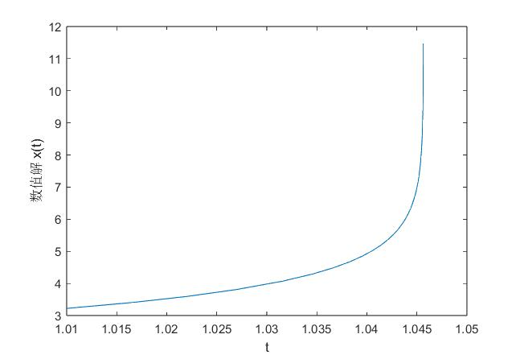

## **Code rk**

### **1.目标**

使用 Matlab 实现RKF54方法，求解初值问题 $\begin{cases}x'=e^{xt}+\cos(x-t)\\x(1)=3 \end{cases}$，取初值步长 $h=0.01$。

### **2.算法**

先计算 $\begin{cases}F_1=hf(t,x)\\F_2=hf(t+\frac{1}{4}h,x+\frac{1}{4}F_1)\\F_3=hf(t+\frac{3}{8}h,x+\frac{2}{32}F_1+\frac{9}{32}F_2)\\F_4=hf(t+\frac{12}{13}h,x+\frac{1932}{2197}F_1-\frac{7200}{2197}F_2+\frac{7296}{2197}F_3)\\F_5=hf(t+h,x+\frac{439}{216}F_1-8F_2+\frac{3680}{513}F_3-\frac{845}{4104}F_4)\\F_6=hf(t+\frac{1}{2}h,x-\frac{8}{27}F_1+2F_2-\frac{3544}{2565}F_3+\frac{1859}{4104}F_4-\frac{11}{40}F_5)\end{cases}$，其中 $f(t,x)=e^{xt}+\cos(x-t)$ 。

五阶方法：$x(t+h)=x(t)+\sum\limits_{i=1}^{6}a_iF_i=x(t)+\frac{16}{135}F_1+\frac{6656}{12825}F_3+\frac{28561}{56430}F_4-\frac{9}{50}F_5+\frac{2}{55}F_6$

四阶方法：$x(t+h)=x(t)+\sum\limits_{i=1}^{6}a_iF_i=x(t)+\frac{25}{216}F_1+\frac{1408}{2565}F_3+\frac{2197}{4104}F_4-\frac{1}{5}F_5$

RKF54 使用五阶方法计算值 $x_5(t)$ 作为最终结果。

自适应步长使用公式 $h=0.9h\left(\frac{\delta}{|e|}\right)^{\frac{1}{1+p}}$，其中 $e=x_5(t)-x_4(t),$ $p=5$ 。

<div STYLE="page-break-after: always;"></div>
### **3.结果**

利用得到的数值解绘制图像：



<div STYLE="page-break-after: always;"></div>
### **4.代码**

```python
RKF54(@(t,x) exp(x*t)+cos(x-t),1,3,0.01,1e-8);
function RKF54(f,t0,x0,h0,delta)
t=t0;x=x0;h=h0;M=50;X=zeros(M,1);Y=X;
fprintf("delta=%g\n",delta);
fprintf("|  i  |   h   |   t   |   x5   |   x4   |   e   |\n");
a1=16/135;a2=0;a3=6656/12825;a4=28561/56430;a5=-9/50;a6=2/55;
b1=25/216;b2=0;b3=1408/2565;b4=2197/4104;b5=-1/5;b6=0;
for i=1:M
    F1=h*f(t,x);
    F2=h*f(t+h/4,x+F1/4);
    F3=h*f(t+h*3/8,x+F1*3/32+F2*9/32);
    F4=h*f(t+h*12/13,x+F1*1932/2197-F2*7200/2197+F3*7296/2197);
    F5=h*f(t+h,x+F1*439/216-F2*8+F3*3680/513-F4*845/4104);
    F6=h*f(t+h/2,x-F1*8/27+F2*2-F3*3544/2565+F4*1859/4104-F5*11/40);
    x5=x+a1*F1+a2*F2+a3*F3+a4*F4+a5*F5+a6*F6;
    x4=x+b1*F1+b2*F2+b3*F3+b4*F4+b5*F5+b6*F6;
    e=abs(x5-x4);t=t+h;x=x5;
    X(i,1)=t;Y(i,1)=x;
    fprintf("| i=%d | %g | %g | %g | %g | %g |\n",i,h,t,x5,x4,e);
    h=0.9*h*(delta/e)^(1/(1+5));
end
figure
plot(X,Y);
xlabel('t')
ylabel('数值解 x(t)')
end

```